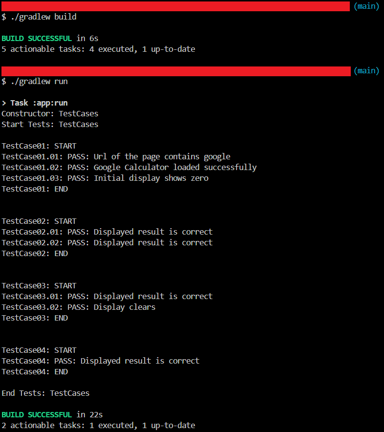

# Google Calculator Automation

`Selenium` `Dynamic Xpaths`

---

During the course of this project automated Google Calculator to validate arithmetic operations and  "AC" button functionality of the Website.

---

# Overview
During the course of this project automated Google Calculator to validate arithmetic operations and  "AC" button functionality of the Website.

# Automating Google Calculator
## Scope of work
* Automated the following test cases:
    * Verify the Homepage URL and Initial Display
    * Verify Addition and Subtraction Operations
    * Verify the Functionality of the All Clear (AC) Button and Multiplication Operation
    * Verify Division Operation

## Skills used
`Selenium` `Dynamic Xpaths`

---

# Screenshots

